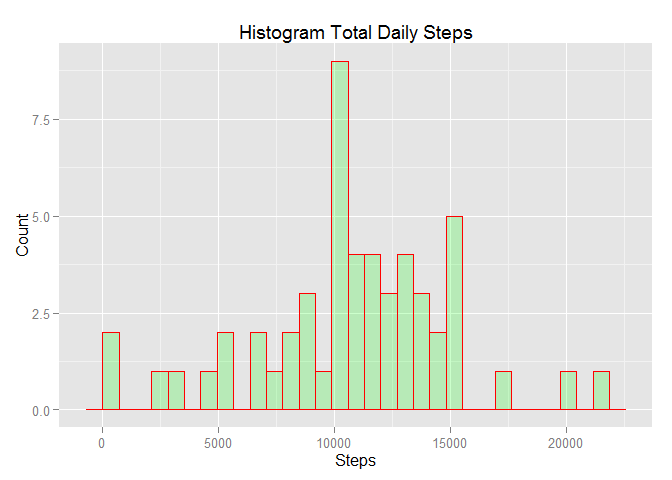
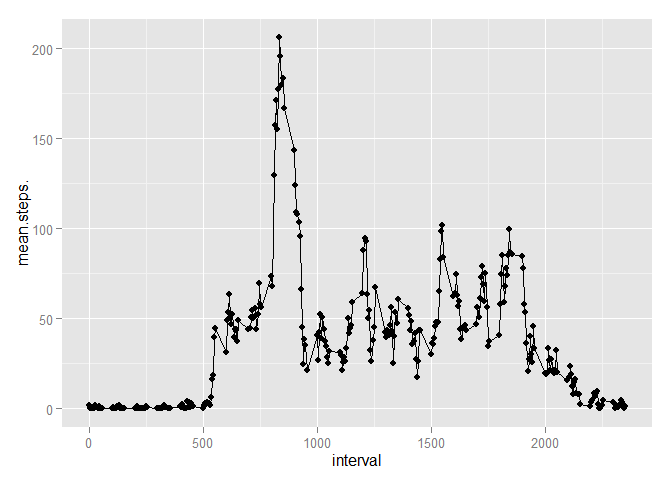
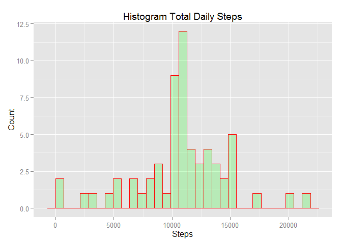
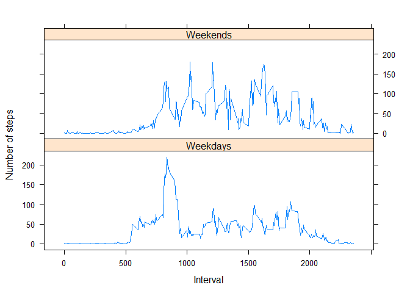

# Reproducible Research: Peer Assessment 1
###by Eric Hullander
###7/18/2015

## Loading and preprocessing the data

## What is mean total number of steps taken per day?

```r
#sum steps by date ignoring NAs and plot a histogram
act_date<-group_by(subset(activity,!is.na(steps)),date)
tots<-summarise(act_date, sum=sum(steps))
ggplot(tots, aes(sum)) + geom_histogram(col="red", fill="green", alpha = .2) +
  labs(title="Histogram Total Daily Steps") +
  labs(x="Steps", y="Count")
```

 

```r
#give mean and median of number of steps
mean(tots$sum)
```

```
## [1] 10766.19
```

```r
median(tots$sum)
```

```
## [1] 10765
```

## What is the average daily activity pattern?

```r
#find average daily steps per five minute inerval and plot time series
act_interval<-group_by(subset(activity,!is.na(steps)),interval)
totsint<-data.frame(summarize(act_interval,mean(steps)))
qplot(x=interval, y=mean.steps., data=totsint) + geom_line()
```

 

```r
#what is five minute interval has most number of steps?
arrange(totsint,desc(mean.steps.))[1,]
```

```
##   interval mean.steps.
## 1      835    206.1698
```

```r
#how many NAs?
summarise(subset(activity,is.na(steps)),n())
```

```
##    n()
## 1 2304
```


## Imputing missing values

```r
#replace NAs with average values per five minute interval "totsint"
replacement1<-select(filter(inner_join(activity,totsint),is.na(steps)),steps=mean.steps.,date,interval)
```

```
## Joining by: "interval"
```

```r
replacement2<-select(filter(inner_join(activity,totsint),!is.na(steps)),steps,date,interval)
```

```
## Joining by: "interval"
```

```r
activity2<-arrange(rbind(replacement1,replacement2),date,interval)
act_date<-group_by(activity2,date)
tots<-summarise(act_date, sum=sum(steps))
ggplot(tots, aes(sum)) + geom_histogram(col="red", fill="green", alpha = .2) +
  labs(title="Histogram Total Daily Steps") +
  labs(x="Steps", y="Count")
```

 

```r
#give mean and median of number of steps
#give mean and median of number of steps
mean(tots$sum)
```

```
## [1] 10766.19
```

```r
median(tots$sum)
```

```
## [1] 10766.19
```
## Are there differences in activity patterns between weekdays and weekends?

```r
#Create Weekend Weekday factor levels
activity2$weekday<-weekdays(as.Date(activity2$date))
activity2$weekend<-activity2$weekday=="Sunday"|activity2$weekday=="Sunday"
activity2$weekend<-as.factor(activity2$weekend)
levels(activity2$weekend)<-c("Weekdays","Weekends")
#group by weekend, summarise and plot
act_interval<-group_by(activity2,interval,weekend)
totsint<-data.frame(summarize(act_interval,mean(steps)))
xyplot(mean.steps. ~ interval| levels(weekend), 
       data = totsint,
       type = "l",
       xlab = "Interval",
       ylab = "Number of steps",
       layout=c(1,2))
```

 

```r
#Folks are more active on the weekend
```
